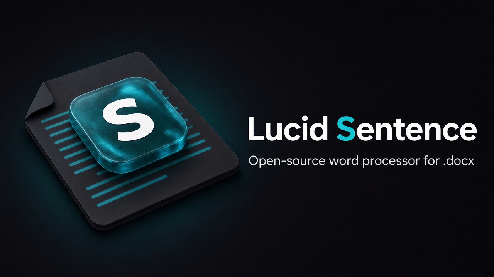

<p align="center">
  
</p>

# Lucid Sentence

A free, open-source word processor for **.docx** with Word’s familiar ribbon and layout, and a fresher look — for Windows, macOS, Android, and iOS/iPadOS.

**Status:** M1 preview — opens, edits, and saves `.docx` with the ONLYOFFICE engine on the device (tables, pictures, headers and footers, print and PDF, spell check in 5 languages), plus an opt-in offline AI assistant.

## Download

> **Preview for testing.** Open, edit, and save your own `.docx` files, entirely on your device. Not every ribbon command works with Word documents yet, and the apps have had little testing on real devices. It works offline and collects nothing.

[](https://github.com/DoctorNurse/Lucid-Sentence/releases/download/v0.1.7-preview/Lucid-Sentence-macOS.dmg)
[](https://github.com/DoctorNurse/Lucid-Sentence/releases/download/v0.1.7-preview/Lucid-Sentence-Windows-Setup.exe)
[](https://github.com/DoctorNurse/Lucid-Sentence/releases/download/v0.1.7-preview/Lucid-Sentence-Android.apk)
[](https://github.com/DoctorNurse/Lucid-Sentence/releases/download/v0.1.7-preview/Lucid-Sentence-Linux.AppImage)

These are **unsigned testing builds** (version 0.1.7-preview). All files, including the Windows `.msi`, the Linux `.deb`, and checksums, are on the [Releases](https://github.com/DoctorNurse/Lucid-Sentence/releases) page.

<details>
<summary><b>Mac</b> (Apple silicon and Intel)</summary>

1. Download **Lucid-Sentence-macOS.dmg** and double-click it.
2. Drag **Lucid Sentence** onto the **Applications** folder.
3. Open it from Applications.

If macOS says it can't check the app for malicious software (this preview isn't notarized yet):

- Right-click (or Control-click) **Lucid Sentence** in Applications, choose **Open**, then **Open** again; or
- On macOS 15 and later: try to open it once, then go to **System Settings → Privacy & Security**, scroll down, and click **Open Anyway** next to the message about Lucid Sentence. Confirm with your password.

</details>

<details>
<summary><b>Windows</b> 10 and 11</summary>

1. Download **Lucid-Sentence-Windows-Setup.exe**.
2. Double-click it. If Windows SmartScreen says "Windows protected your PC", click **More info**, then **Run anyway**.
3. Follow the installer. Lucid Sentence appears in the Start menu.

</details>

<details>
<summary><b>Android</b> phones and tablets</summary>

1. On your Android device, download **Lucid-Sentence-Android.apk**.
2. Open the downloaded file. If Android asks, allow your browser or Files app to **install unknown apps**.
3. Tap **Install**, then **Open**.

This APK is for 64-bit ARM, which nearly every Android phone and tablet uses. Each release also has **Lucid-Sentence-Android-armv7.apk** for older 32-bit phones and **Lucid-Sentence-Android-x86_64.apk** for emulators and Intel or AMD Chromebooks. The app updates from the one that matches it.

If you installed **0.1.0-preview**, uninstall it first: it was signed with a temporary key, so Android won't install a newer version over it. From 0.1.1-preview on, updates install over the app you have.

</details>

<details>
<summary><b>iPhone and iPad</b> (add the web app to your Home Screen)</summary>

There's no App Store build yet. Instead, install the web app:

1. Open **https://doctornurse.github.io/Lucid-Sentence/** in **Safari**.
2. Tap the **Share** button (on newer iOS versions it can be inside the **•••** menu), then **Add to Home Screen**.
3. Tap **Add**. Open **Sentence** from your Home Screen. It runs full screen and works offline after the first visit.

</details>

<details>
<summary><b>Linux</b></summary>

1. Download **Lucid-Sentence-Linux.AppImage** (or the `.deb` for Debian and Ubuntu).
2. Make it executable: right-click → Properties → Permissions → "Allow executing", or run `chmod +x Lucid-Sentence-Linux.AppImage`.
3. Double-click it. For the `.deb`: `sudo apt install ./Lucid-Sentence-Linux.deb`.

</details>

<details>
<summary><b>Updates</b></summary>

- **Mac, Windows, Linux** (0.1.1-preview and later): the app checks for an update a few seconds after it opens, downloads it in the background, and shows **Restart to update**. Updates are signed, and the app checks the signature before installing. 0.1.0-preview can't update itself: install the new version by hand once.
- **Android**: the app checks GitHub Releases when it opens and offers **Download update**. Open the downloaded file and tap **Update**.
- **iPhone, iPad, and the web app**: when a new version has downloaded, the app shows **Reload for new version**.

Checks are skipped when you're offline.

</details>

## Try the demo

`pnpm dev` opens `apps/demo`: the full ribbon on a lightweight stand-in editor. What works today:

- **Editing**: fonts, sizes, bold/italic/underline and more, paragraph alignment, lists, indents, styles gallery (Title, Headings, Quote), tables with contextual Table Design and Layout tabs, pictures, links, page breaks, find and replace, undo/redo.
- **Ribbon**: desktop, tablet (touch), and phone layouts from one command registry; contextual tabs; collapse (Ctrl+F1); Quick Access Toolbar; command search (Alt+Q); File backstage (Info, New, Open, Save, Print, Options).
- **Pages**: Letter or A4, orientation, margins, rulers, zoom (fit width, one page, percent), page count, navigation pane, comments in the margin, Read, Focus, and Web layouts.
- **Pen and tablet**: ink with pressure and tilt, pencil, highlighter, erasers, lasso; palm rejection, pen hover preview, barrel-button erase, auto-switch to drawing when a pen touches the page. See [docs/TABLET.md](docs/TABLET.md).
- **Notes mode**: lined, grid, or dotted paper; floating pen toolbar with favorites; magnifier strip; audio recording kept in sync with ink and typing (tap a line to hear that moment), stored only on the device.
- **Themes**: light, dark, high contrast; white pages by default in every theme.

Commands that need the engine (for example mail merge, citations, track changes) show a "coming with the engine" tooltip and are marked as pending.

## Goals

- Word-equivalent commands, dialogs, and shortcuts
- Full ribbon parity (File through Help, plus contextual tabs)
- High .docx / page-layout fidelity (Print Layout)
- One shared UI layer across four platforms, offline-first
- **v1 ships the entire Word ribbon on desktop, tablet, and phone** (touch changes layout only, not which commands exist)
- Free and copyleft (**AGPL-3.0**); no paid tier, no telemetry by default, no account required

## Non-goals (v1)

- Legacy `.doc` open/save (possible later: one-way import to `.docx`)
- Other edit formats (ODT, RTF) or spreadsheet/presentation apps
- Real-time co-authoring or cloud services
- Running VBA macros (`.docm` macros preserved, not executed)
- Microsoft 365–only features (Copilot, cloud Editor, etc.) — ribbon slots kept as stubs
- Copying Microsoft icons or artwork

## Splash promo

On launch, official builds may show **one** small card for another Lucid Systems app (currently [Chapternal](https://chapternal.com)). The card is clearly labeled, closes with ✕ or Esc, and makes no tracking or network calls. Promos are only for Lucid Systems apps. Forks and distributions can turn them off; see [`packages/splash`](packages/splash/README.md).

## Platforms

Windows · macOS · Android · iOS/iPadOS

## Engine

Built on **ONLYOFFICE** 9.4+ (OOXML-native, AGPL-3.0). **Collabora / LibreOfficeKit** is the fallback if the Phase 0 mobile go/no-go gate or fidelity bake-off says so. Decision is pending the M0 evaluation.

Native format: **.docx** (plus `.dotx` / `.docm`). PDF is export-only.

## Roadmap (scope only)

| Milestone   | Focus                                                                                    |
| ----------- | ---------------------------------------------------------------------------------------- |
| **M0**      | Foundations, fidelity bake-off, mobile go/no-go, counsel/name clearance                  |
| **M1**      | Platform alpha — command registry, three-layout ribbon, local open/save on all platforms |
| **Alpha A** | Authoring tabs (Home, Insert, Layout, Design, View) + contextual tabs                    |
| **Alpha B** | Review and Draw                                                                          |
| **Alpha C** | References and Mailings                                                                  |
| **Beta 1**  | Feature-complete (100% non-stub command list)                                            |
| **Beta 2**  | Release candidate — performance, a11y, localization, channels                            |
| **v1.0**    | Four-platform release                                                                    |

After v1: polish, optional Linux packaging, optional `.doc` import, optional collaboration, on-device extras.

## License

[AGPL-3.0](LICENSE). Lucid Sentence will be based on ONLYOFFICE software developed by Ascensio System SIA (with required attribution and legal notices when code lands).

## Trademark

Lucid Sentence is **not affiliated with Microsoft**. Word is a trademark of Microsoft Corporation.

## Repository

| Path                 | What it is                                                                                 |
| -------------------- | ------------------------------------------------------------------------------------------ |
| `packages/commands`  | Single command registry: every tab → group → command, with desktop/tablet/phone placements |
| `packages/ribbon-ui` | `<ls-ribbon>` web component rendering the registry in three layouts, with themes           |
| `packages/tokens`    | Design tokens (light, dark, high contrast) from Chapternal, plus bundled OFL UI fonts      |
| `packages/splash`    | Splash/loading screen with one optional promo per launch for Lucid Systems apps            |
| `apps/demo`          | Vite demo: ribbon on a working stand-in editor, pen input, Notes mode                      |
| `apps/shell`         | Installable preview: Tauri 2 app wrapping the web app for desktop and Android              |
| `apps/desktop`       | Planned ONLYOFFICE DesktopEditors fork (placeholder); generated desktop icons              |
| `apps/mobile`        | Planned Capacitor shell for Android and iOS (placeholder)                                  |
| `engine/`            | Planned ONLYOFFICE 9.4+ integration and attribution obligations                            |
| `assets/brand/`      | Vector icon master, generated icons (`pnpm icons`), banner, and social preview             |
| `eval/`              | M0 fidelity bake-off and mobile go/no-go gate                                              |

## Development

Requires Node.js 20.19+ and pnpm 10 (`corepack enable`).

```sh
pnpm install
pnpm dev        # ribbon demo at http://localhost:5173
pnpm lint && pnpm typecheck && pnpm test && pnpm build
pnpm e2e        # Playwright tests (Chromium): editor, pen, Notes mode
pnpm icons      # regenerate every app icon from assets/brand/src/icon.svg
```

## Contributing

Issues and Discussions are welcome. See [CONTRIBUTING.md](CONTRIBUTING.md): **signed commits are required**, plus DCO sign-off (`git commit -s`). Please also read the [Code of Conduct](CODE_OF_CONDUCT.md) and [Security Policy](SECURITY.md).

## Planning document

Full plan (draft v0.5): **[docs/PLAN.md](docs/PLAN.md)**

Design system and token sources: **[docs/DESIGN.md](docs/DESIGN.md)**

Tablet, stylus, and Notes mode: **[docs/TABLET.md](docs/TABLET.md)**
